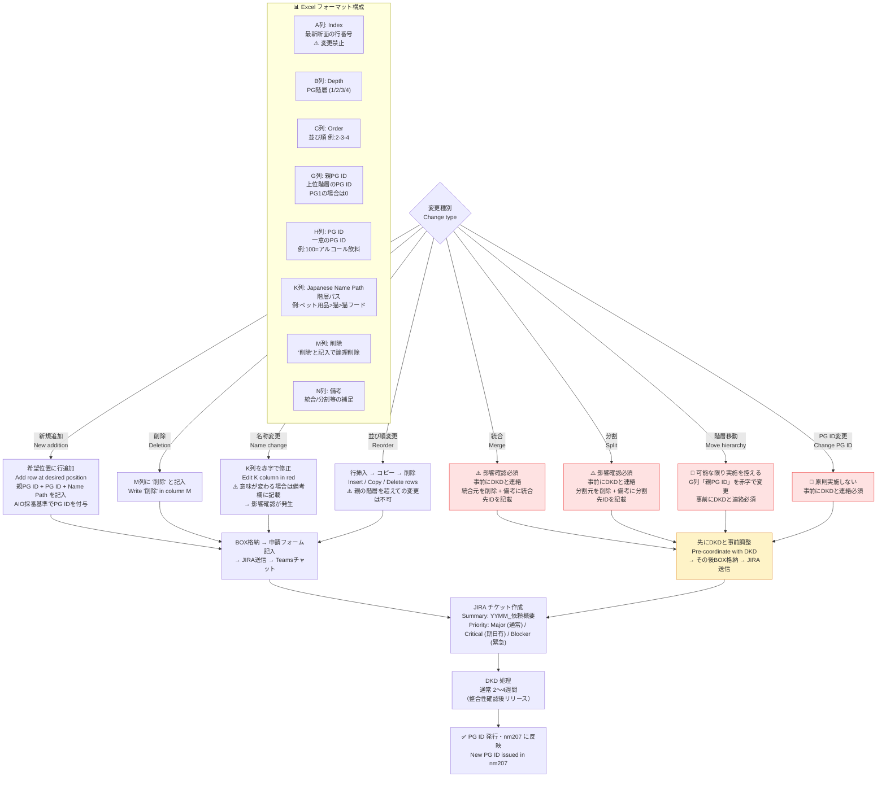
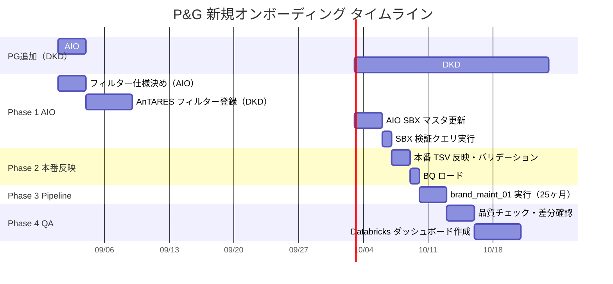

# ope-master Update — Sample Case & Flow / サンプルケース付き更新手順

> **Reference / 参照元:**  
> - AIO 手順書: https://confluence.rakuten-it.com/confluence/spaces/AIO/pages/6863144149/  
> - Product Group Request Manual: https://confluence.rakuten-it.com/confluence/spaces/DM/pages/5973552358/  
> - Full procedure: [ope_master_update_procedure_bilingual.md](ope_master_update_procedure_bilingual.md)  
> - Visual flowcharts: [ope_master_update_flowchart.md](ope_master_update_flowchart.md)

---

## Sample Case: P&G — New Client Onboarding (Household / Daily Care)

**Scenario / シナリオ:**  
P&G（プロクター＆ギャンブル）を新規クライアントとして追加する。  
対象カテゴリは「日用品（洗濯用洗剤）」。現行のProduct Groupに「洗濯用洗剤」PG3が存在しないため、PG追加から始まる。

> P&G is a **brand-new client** — no RMP masters exist. Everything must be authored from scratch.  
> The target product "洗濯用洗剤（laundry detergent）" does not yet exist as a PG3 under 日用品, so a Product Group addition is required first.

---

## 1. Overall Sample Flow / サンプル全体フロー

```mermaid
flowchart TD
    START([🆕 P&G 新規クライアント要件受領\nNew client P&G requirement received])

    START --> STEP1

    subgraph CHECK["🔍 事前確認 Pre-check  ／  AIO（佐藤）"]
        STEP1["既存 Product Group を確認\nCheck existing PGs\nG-Gemini から最新 PG リストをダウンロード"]
        STEP1 --> PG_EXISTS{「洗濯用洗剤」\nPG3 は存在するか?\nDoes PG3 exist?}
        PG_EXISTS -->|✅ Yes| SKIP_PG["PG追加不要\nSkip PG request\n→ AIO SBX マスタ更新へ"]
        PG_EXISTS -->|❌ No| PG_PROC["PG 追加手続きへ\nGo to PG addition process"]
    end

    subgraph PG_ADD["📋 Product Group 追加  ／  AIO → DKD（2〜4週間）"]
        PG_PROC --> PG_DL["① 更新フォーマット（Excel）をダウンロード\nDownload update format\n📎 https://rak.box.com/s/q9saqjm9n4h2l266gogg7sslg0gxfchj"]
        PG_DL --> PG_EDIT["② Excel を編集\nEdit the format\n行追加: 日用品 > 洗濯・衣類ケア > 洗濯用洗剤\n親PG ID / PG ID / Japanese Name Path を記入"]
        PG_EDIT --> PG_BOX["③ BOX フォルダに格納\nUpload to BOX\n権限: People in Your Company"]
        PG_BOX --> PG_FORM["④ 申請フォームに記入 & JIRA 送信\nFill form & send JIRA\n📎 https://confluence.rakuten-it.com/confluence/x/ksDkYwE\nSummary: 2608_P&G日用品PG追加\nPriority: Major"]
        PG_FORM --> PG_TEAMS["⑤ Teams チャンネルまたは DKD にチャット\nNotify DKD via Teams / chat"]
        PG_TEAMS --> PG_WAIT["⑥ DKD が処理\nDKD processes request\n⏳ 通常 2〜4 週間"]
        PG_WAIT --> PG_DONE["⑦ 新規 PG ID 発行・反映完了\nNew PG ID issued & registered\n例: 日用品(100) > 洗濯(10050) > 洗濯用洗剤(10051)"]
    end

    SKIP_PG --> ANTARES_START
    PG_DONE --> ANTARES_START

    subgraph PHASE1["📋 Phase 1 — AIO SBX マスタ定義  ／  AIO（佐藤）（基本月1回）"]
        ANTARES_START["AnTARES フィルター仕様決め\nDecide filter spec\nGTIN vs filtersetcode 境界を決定"]
        ANTARES_START --> DKD_ANTARES["DKD: AnTARES フィルター登録\nRegister in AnTARES\n→ filtersetcode 発行"]
        DKD_ANTARES --> SBX_UPDATE["AIO SBX マスタ一括更新\nUpdate all SBX master tables\n（下記テーブルを参照）"]
        SBX_UPDATE --> SBX_VERIFY["SBX 検証クエリ実行\nRun verification queries\nJAN確認 / 階層チェック / ブランド確認"]
    end

    subgraph PHASE2["⚙️ Phase 2 — 本番反映  ／  AIO ツール操作"]
        SBX_VERIFY --> PROD_TSV["本番 TSV 反映\ndeleteflg=1 除外\nrep-batch-data/ope_master_data/nsl/"]
        PROD_TSV --> VALID["バリデーション実行\nexe_nsl_ope_master_validation.sh"]
        VALID --> VALID_OK{PASS?}
        VALID_OK -->|❌ FAIL| FIX["修正 → 再バリデーション"]
        FIX --> VALID
        VALID_OK -->|✅ PASS| BQ_LOAD["BQ ロード\nexe_load_nsl_hive_ope_master_data.sh"]
    end

    subgraph PHASE3["🔄 Phase 3 — パイプライン実行  ／  ECFD（Erin）"]
        BQ_LOAD --> MAINT["brand_maint_01 実行\n新規クライアント → 25ヶ月再集計\nnt231/nm233/ns215/af021 再構築"]
    end

    subgraph PHASE4["✅ Phase 4 — QA・ダッシュボード  ／  ECFD → AIO"]
        MAINT --> QA["品質チェック・数値差分確認\nQuality check & numeric diff"]
        QA --> DB["Databricks ダッシュボード作成\nCreate P&G dashboards\n日用品:売上分析 / マーケットシェア 等"]
    end

    DB --> DONE([✅ P&G オンボーディング完了\nOnboarding complete])

    style CHECK fill:#e0f2fe,stroke:#0284c7
    style PG_ADD fill:#fef3c7,stroke:#d97706
    style PHASE1 fill:#dbeafe,stroke:#3b82f6
    style PHASE2 fill:#fef9c3,stroke:#eab308
    style PHASE3 fill:#dcfce7,stroke:#22c55e
    style PHASE4 fill:#fae8ff,stroke:#a855f7
    style START fill:#1e40af,color:#fff,stroke:#1e40af
    style DONE fill:#15803d,color:#fff,stroke:#15803d
    style FIX fill:#fee2e2,stroke:#ef4444
    style PG_WAIT fill:#fff7ed,stroke:#ea580c
```



---

## 2. Product Group Request Flow / PG追加依頼フロー詳細



---

## 3. Sample Case — Table Updates Required / サンプル更新テーブル一覧

**Case: P&G 新規契約 + 「洗濯用洗剤」PG3 追加**

| Step | Table | Operation | Content |
|---|---|---|---|
| PG追加（DKD対応）| nm207 | INSERT | 洗濯用洗剤 PG3 追加（親:洗濯・衣類ケア PG2）|
| 1 | nm201 | INSERT | P&G メーカー登録（maker_id 新規採番）|
| 2 | nm202 | INSERT | アリエール / ボールド / レノア 等 ブランド登録 |
| 3 | nm203 | INSERT | 各ブランドの RAN コード（GTIN）登録 |
| 4 | nm204 | INSERT | P&G 契約BU 登録（contract_business_unit_id 新規）|
| 5 | nm205 | INSERT | 契約ブランド登録（rank_aggregation_period 設定）|
| 6 | nm206 | INSERT | 競合ブランド登録（花王 / ライオン 等 + 表示マスク名）|
| 7 | nm208 | INSERT | ブランド階層登録（level 1/2/3 + RAN leaf level 4）|
| 8 | nm209 | INSERT | ロイヤルティランク閾値設定（L/M/H/ExH × MONETARY/REPEAT）|
| 9 | nm210 | INSERT | 契約ブランド × 商品ブランド対応 |
| 10 | nm227 | INSERT | brand_layer_id → filtersetcode 紐付け |
| 11 | nm228 | INSERT | product_group_id × product_brand_id → filtersetcode |
| 12 | nm230 | INSERT | ブランドグループ（汎用）登録 |
| 13 | nm243 | INSERT | ブランドグループマスタ登録 |

**SBX 検証クエリで確認：**
```sql
-- ①JAN登録確認（nm203 + nm202 + nm201 + nm207 JOIN）
-- ②階層チェック（nm208 level 1→2→3→4 chain）
-- ③ブランド登録状況（nm202 + nm230 + nm228 filtersetcode 確認）
WHERE a.deleteflg = 0 AND a.product_brand_id >= 1000
-- → 新規登録の P&G ブランドが正しく表示されることを確認
```

**Pipeline trigger after masters loaded:**
```
brand_maint_01  ← 新規クライアントなので 25ヶ月再集計
  → nm233 brand_layer_item 再構築（新ブランドとアイテムの紐付け）
  → nt231 brand_layer_orders 再構築
  → ns215 loyalty_rank_history 再構築
  → af021 brand_sales (ASL) 再構築
```

---

## 4. Product Group Format Column Reference / PGフォーマット カラム早見表

| Column | Name | Description / 説明 | Editable |
|:---:|---|---|:---:|
| A | Index | G-Gemini最新断面の行番号 / Row index from latest snapshot | ❌ 禁止 |
| B | Depth | PG階層レベル (1/2/3/4) | ❌ 禁止 |
| C | Order | 並び順 例: "2-3-4" / Sort order | ❌ 禁止 |
| G | 親PG ID | 1つ上の階層PG ID (PG1は0) / Parent PG ID | ✅ 赤字 |
| H | PG ID | 一意のPG ID / Unique PG ID | ⚠️ 原則禁止 |
| K | Japanese Name Path | 階層パス例: ペット>猫>猫フード / Hierarchy path | ✅ 赤字 |
| M | 削除 | '削除'と記入 / Write '削除' to delete | ✅ |
| N | 備考 | 統合/分割/その他補足 / Notes for merge/split/etc. | ✅ |

---

## 5. Timeline / タイムライン



---

## 6. Useful Links / 関連リンク

| Resource | URL |
|---|---|
| PG Request Format (Excel) | https://rak.box.com/s/q9saqjm9n4h2l266gogg7sslg0gxfchj |
| PG Request Form (Confluence/JIRA) | https://confluence.rakuten-it.com/confluence/x/ksDkYwE |
| PG Request Manual | https://confluence.rakuten-it.com/confluence/spaces/DM/pages/5973552358/ |
| PG Teams Channel | [プロダクトグループ定義関連 — Teams](https://teams.microsoft.com/l/channel/19%3Aee885af94ff044dc8ef80eaefe62c6d8%40thread.tacv2/) |
| AIO Procedure Doc | https://confluence.rakuten-it.com/confluence/spaces/AIO/pages/6863144149/ |
| AnTARES Manual | https://rak.app.box.com/s/shtjxz3tzefwokml5wewfb2n415r0m7t |
| Jira Epic | https://jira.rakuten-it.com/jira/browse/CONRAT-44285 |
| P&G Jira | https://jira.rakuten-it.com/jira/browse/CONRAT-44597 |
