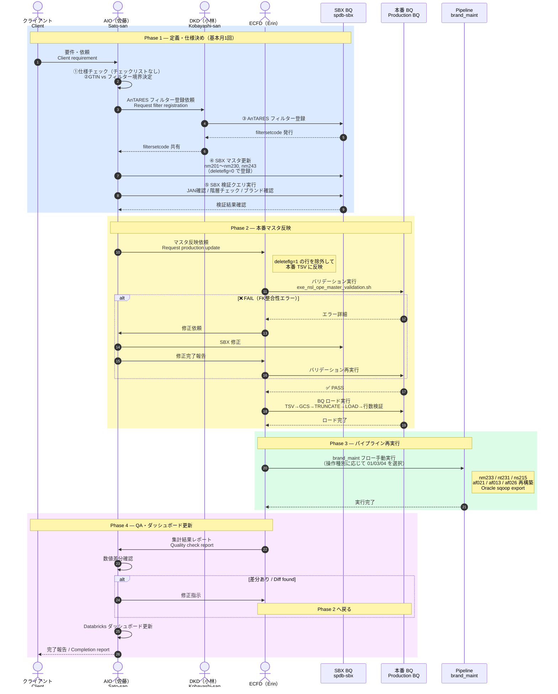
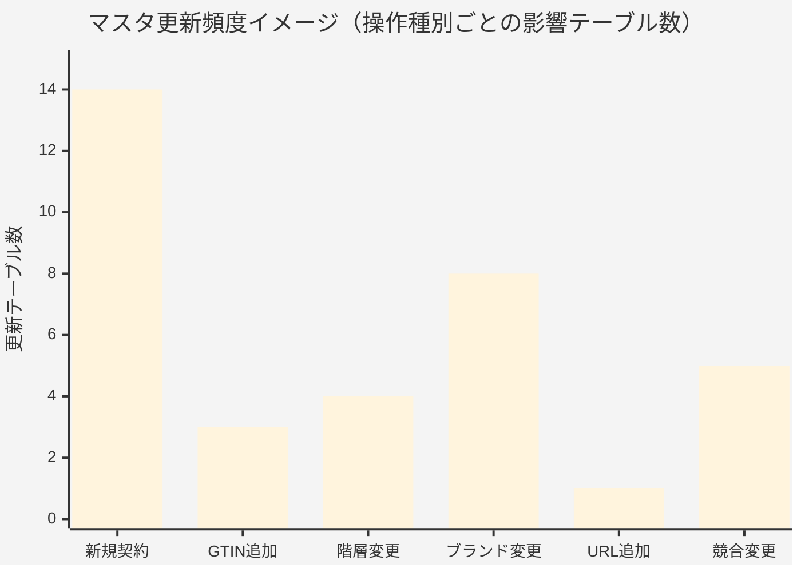
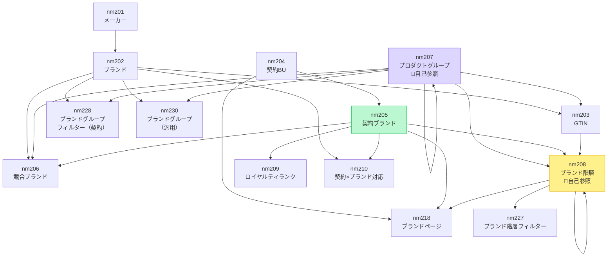

# ope-master Update Flow / 更新フロー

> Full procedure: [ope_master_update_procedure_bilingual.md](ope_master_update_procedure_bilingual.md)

---

## 1. Overall Flow / 全体フロー図

```mermaid
flowchart TD
    START([🔔 クライアント要件受領\nClient requirement received])

    START --> SPEC

    subgraph P1["📋 Phase 1 — 定義・仕様決め  AIO + DKD  ／  基本月1回"]
        SPEC["① 依頼仕様詳細チェック\nSpec check\n📌 AIO（佐藤）\nチェックリストなし・判断ベース"]
        SPEC --> BOUNDARY
        BOUNDARY["② GTIN vs フィルター境界決定\nGTIN vs filter boundary decision\n📌 AIO（佐藤）"]
        BOUNDARY --> ANTARES
        ANTARES["③ AnTARES フィルター登録\nRegister filter in AnTARES\n📌 DKD（小林）\n→ filtersetcode 発行"]
        ANTARES --> SBX
        SBX["④ AIO SBX マスタ更新\nUpdate AIO SBX master tables\n📌 AIO（佐藤）\nspdb-sbx.sbx_icb_homelife.*\nnm201〜nm230, nm243"]
        SBX --> VERIFY
        VERIFY["⑤ SBX 検証クエリ実行\nRun SBX verification queries\n📌 AIO（佐藤）\nJAN確認 / 階層チェック / ブランド確認"]
    end

    VERIFY --> PG_CHECK{プロダクトグループ\n追加が必要?\nNew product group\nneeded?}
    PG_CHECK -->|Yes| PG_REQ["DKD へ PG追加依頼\nRequest PG addition to DKD\n依頼フォーム経由"]
    PG_REQ --> PROD_TSV
    PG_CHECK -->|No| PROD_TSV

    subgraph P2["⚙️ Phase 2 — 本番マスタ反映  ／  AIO ツール操作（client & DKD 確認ベース）"]
        PROD_TSV["本番 TSV 反映\nReflect to production TSV\n⚠️ deleteflg=1 は除外\nrep-batch-data/ope_master_data/nsl/"]
        PROD_TSV --> VALID
        VALID["バリデーション実行\nexe_nsl_ope_master_validation.sh\nFK整合性チェック全13マスタ"]
        VALID --> VALID_RESULT{全チェック PASS?\nAll checks passed?}
        VALID_RESULT -->|❌ FAIL| FIX_TSV["TSV 修正\nFix TSV\n📌 AIO / ECFD"]
        FIX_TSV --> VALID
        VALID_RESULT -->|✅ PASS| BQ
        BQ["BQ ロード実行\nexe_load_nsl_hive_ope_master_data.sh\nTSV → GCS → TRUNCATE → LOAD → 行数検証"]
    end

    BQ --> MAINT_TYPE

    subgraph P3["🔄 Phase 3 — パイプライン再実行  ／  ECFD（Erin）"]
        MAINT_TYPE{操作種別\nOperation type}
        MAINT_TYPE -->|新規クライアント\nブランド定義変更\nNew client / brand change| M01
        MAINT_TYPE -->|四半期フル再集計\nQuarterly full re-agg| M03
        MAINT_TYPE -->|GTIN追加・URL追加\nGTIN / URL addition| M04
        M01["brand_maint_01\n25ヶ月再集計\nnt231 / nm233 / ns215\naf021 / af013 / af026 再構築"]
        M03["brand_maint_03\n25ヶ月フル再集計\nFull 25-month re-aggregation"]
        M04["brand_maint_04\n日次 catch-up\nDaily incremental"]
        M01 & M03 & M04 --> PIPE_DONE
        PIPE_DONE["パイプライン完了\nPipeline complete\nOracle sqoop export → Tableau 更新"]
    end

    PIPE_DONE --> QA_CHECK

    subgraph P4["✅ Phase 4 — QA・ダッシュボード更新  ／  ECFD → AIO"]
        QA_CHECK["集計結果品質チェック\nQuality check\n📌 ECFD → AIO に報告"]
        QA_CHECK --> DIFF{数値差分あり?\nNumeric diff found?}
        DIFF -->|Yes| CORRECT["修正指示 & 対応\nCorrection\n📌 AIO（佐藤）\n→ Phase 2 へ戻る"]
        CORRECT --> PROD_TSV
        DIFF -->|No| DASHBOARD
        DASHBOARD["Databricks ダッシュボード更新\nUpdate Databricks dashboards\n📌 AIO（佐藤）"]
    end

    DASHBOARD --> DONE([✅ 完了 / Complete])

    %% Styling
    style P1 fill:#dbeafe,stroke:#3b82f6,color:#1e3a5f
    style P2 fill:#fef9c3,stroke:#eab308,color:#713f12
    style P3 fill:#dcfce7,stroke:#22c55e,color:#14532d
    style P4 fill:#fae8ff,stroke:#a855f7,color:#3b0764
    style START fill:#1e40af,color:#fff,stroke:#1e40af
    style DONE fill:#15803d,color:#fff,stroke:#15803d
    style FIX_TSV fill:#fee2e2,stroke:#ef4444
    style CORRECT fill:#fee2e2,stroke:#ef4444
```

---

## 2. Team Interaction / チーム間インタラクション（シーケンス図）

---

## 3. Master Table Update Matrix / マスタ更新マトリクス（ヒートマップ）

---

## 4. FK Dependency / FK依存関係

> 💡 **読み方 / How to read:** 矢印は「参照される → 参照する」方向（FK の向き）。  
> Arrow direction = "referenced → referencing" (FK direction).  
> nm208 と nm207 はハブテーブル — 多くのテーブルに参照される。  
> nm208 and nm207 are hub tables — referenced by many others.
