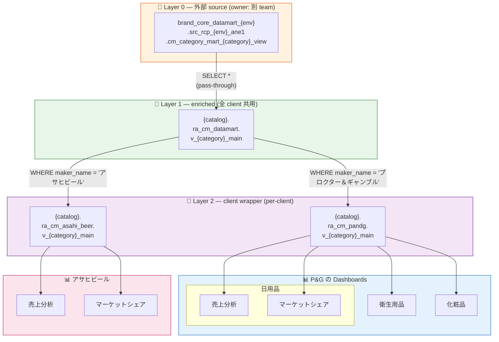
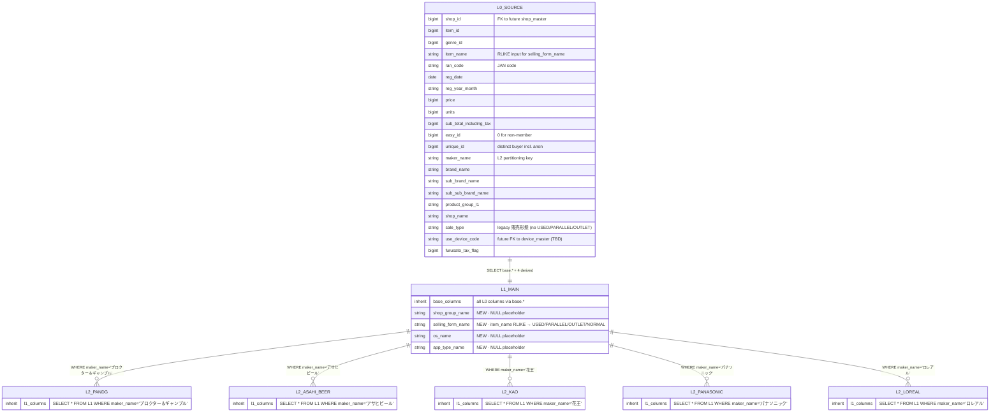

# RA_CM Design Overview

*Last updated: 2026-08-18 13:30 JST — §1 に column-level ER diagram (L0→L1→L2 lineage) を追加。詳細は [DESIGN_ER.md](DESIGN_ER.md) 参照。*

CM Dashboard の `ra_cm_` **命名 3-layer view architecture** の概要。全体像、命名規則、Layer 1/2 の責務を扱う。

---

## 1. 全体像 — 3-Layer View Architecture

CM Dashboard は **Layer 0 (source) → Layer 1 (enriched) → Layer 2 (client wrapper) → Dashboard SQL** の 3 層構造で、各層に明確な責務を分離する。




> **📌 重要**: Dashboard は **client 毎に別々**に作成される（Lakeview UI 上で client_id を跨がない）。P&G の dashboard は `ra_cm_pandg.v_`* のみ、Asahi Beer の dashboard は `ra_cm_asahi_beer.v_`* のみを参照。Schema 単位の GRANT がそのまま dashboard の可視範囲になる。

### Entity relationships (column level)

上の flowchart は entity 単位の流れを示す。以下の ER diagram は同じ lineage を **column 単位** で表現し、L0 の key column と L1 で追加される 4 派生列を明示する。Column-level detail / 1 record 例 / 将来 JOIN 予定 master は [DESIGN_ER.md](DESIGN_ER.md) を参照。



### 各層の責務


| Layer         | Object                                | Owner                   | 責務                                                                                                              | Consumer      |
| ------------- | ------------------------------------- | ----------------------- | --------------------------------------------------------------------------------------------------------------- | ------------- |
| **Layer 0**   | 外部 source view                        | 別 team (Datamart / ETL) | Raw data + 基本 enrichment（既に多数の派生列済）                                                                             | Layer 1       |
| **Layer 1**   | `ra_cm_datamart.v_{category}_main`    | CM Dashboard team       | **全 client 共通の enrichment 拠点** PoC 段階: `base.*` + 4 RMP-parity 派生列 (`shop_group_name` / `selling_form_name` / `os_name` / `app_type_name`) 将来: 外部 JOIN (shop_group, user_info, device_info) の実データを NULL placeholder に流し込む | Layer 2       |
| **Layer 2**   | `ra_cm_{client_id}.v_{category}_main` | CM Dashboard team       | **client filter (**`WHERE maker_name = X`**) + 権限境界**                                                           | Dashboard SQL |
| **Dashboard** | Lakeview widget dataset               | Dashboard designer      | UI parameter + 集計 (SUM, COUNT, GROUP BY)                                                                        | End user      |


---

## 2. 命名規則

### 2-1. 環境分離戦略 — **catalog level only**

env（STG / PROD）は Databricks **catalog** で区別し、schema / view 名には env suffix を付けない。**同名 schema が STG catalog と PROD catalog の両方に存在**する。


| 次元                 | STG                                          | PROD                                     | 備考               |
| ------------------ | -------------------------------------------- | ---------------------------------------- | ---------------- |
| **Catalog**        | `maker_sight_analytics_stg_8259555975886417` | `maker_sight_analytics_8259563251318375` | env で異なる         |
| **Layer 1 Schema** | `ra_cm_datamart`                             | `ra_cm_datamart`                         | env 共通           |
| **Layer 2 Schema** | `ra_cm_{client_id}`                          | `ra_cm_{client_id}`                      | env 共通           |
| **View 名**         | `v_{category}_main`                          | `v_{category}_main`                      | env 共通、client 共通 |


**利点**:

- Deploy target 切替のみで env を移動できる（文字列書換不要）
- SQL / dashboard code が env 中立になる
- Placeholder `__CATALOG__` の解決だけで STG/PROD 対応

### 2-2. Schema prefix — `ra_cm_`


| 部分        | 意味                                                                         |
| --------- | -------------------------------------------------------------------------- |
| `ra_`     | **R**akuten **A**nalytics — 所属チーム識別                                        |
| `cm_`     | **C**ategory **M**art — Layer 0 source (`cm_category_mart_`*) と同じデータドメイン識別 |
| `{scope}` | `datamart`（Layer 1 共有）or `{client_id}`（Layer 2 per-client）                 |


**なぜ** `ra_` **付き？**: Layer 0 source view の schema (`cm_category_mart_`* — 外部 owner) と識別。同じ Unity Catalog 内で複数チーム の `cm_`* 資産が混在しても衝突しない。

### 2-3. View 名 — `v_{category}_main`

**client 名も dashboard 名も含めない**。理由:

- **schema が client を表す** (`ra_cm_pandg.v_daily_necessities_main`) — 同じ view 名を全 client で共用
- **1 category = 1 Layer 2 view** — 「P&G の日用品」用に `v_daily_necessities_main` 1 本
- Dashboard 別に view を作らない — dashboard の filter/aggregation は SQL 側で定義

---

## 3. Layer 1 — Enriched Views（category-shared）

### 3-1. 目的

**「CM が持たないが、RMP では提供できているデータ」を外部 source から JOIN で足す拠点**。将来の shop_group / user_segment / device_os 等を Layer 1 に足せば **全 client の全 dashboard に自動反映**（downstream 無修正）。

### 3-2. 将来（外部ソース確定後）

```sql
CREATE OR REPLACE VIEW ra_cm_datamart.v_daily_necessities_main AS
SELECT
  base.*,
  s.shop_group,   s.shop_area,
  u.user_segment, u.member_grade,
  d.device_os,    d.device_type
FROM brand_core_datamart_stg.src_rcp_stg_ane1.cm_category_mart_daily_necessities_view base
LEFT JOIN {tbd}.shop_master   s ON base.shop_id    = s.shop_id
LEFT JOIN {tbd}.user_master   u ON base.easy_id    = u.easy_id
LEFT JOIN {tbd}.device_master d ON base.session_id = d.session_id;
```

**Category ごと**に 1 view（今後 `v_hygiene_and_medicine_main` / `v_cosmetics_main` / `v_alcohol_main` も追加予定）。

---

## 4. Layer 2 — Client Wrapper Views（per-client）

### 4-1. 目的

- **Client filter** (`WHERE maker_name = 'X'`) を集約
- **権限境界** — GRANT SELECT ON SCHEMA `ra_cm_{client}` で client SP に一括付与（1-shot）
- **Dashboard SQL の env / client 依存を最小化** — dashboard は Layer 2 view の schema/catalog を placeholder 化するだけ

### 4-2. DDL パターン

```sql
CREATE OR REPLACE VIEW ra_cm_pandg.v_daily_necessities_main AS
SELECT *
FROM ra_cm_datamart.v_daily_necessities_main
WHERE maker_name = 'プロクター＆ギャンブル';
```

**注意**: Databricks default view は **invoker's rights** (呼び出し元の権限で解決)。Layer 2 wrapper が Layer 1 を SELECT できない SP に対しては、Layer 1 に個別 GRANT を追加する必要がある可能性あり (Phase 3 で確定)。

### 4-3. Per-client schema の利点


| 利点            | 説明                                                                 |
| ------------- | ------------------------------------------------------------------ |
| **Isolation** | client A が client B の schema を SHOW/SELECT 不可（Unity Catalog GRANT） |
| **GRANT 単純化** | `GRANT SELECT ON SCHEMA ra_cm_pandg` を 1 回 → 中の全 view に自動適用        |
| **Auditing**  | Databricks system table で schema 別に query 監査可能                     |
| **Rollback**  | 特定 client のみ `DROP SCHEMA CASCADE` で isolated cleanup              |
| **Scale-out** | 新 client 追加時に schema を CREATE するだけ、既存 client に影響なし                 |


### 4-4. Category × Client Matrix

現時点で planned な (client, category) 組み合わせ:


| Client / Category             | daily_necessities | hygiene_and_medicine | cosmetics | alcohol |
| ----------------------------- | ----------------- | -------------------- | --------- | ------- |
| **P&G** (`pandg`)             | ✅                 | ✅                    | ✅         | —       |
| **Asahi Beer** (`asahi_beer`) | —                 | —                    | —         | ✅       |


各 category が sales_analysis / brand_distribution 等の **8+ 種類の dashboard** を持つ想定（PoC は sales_analysis のみ）。