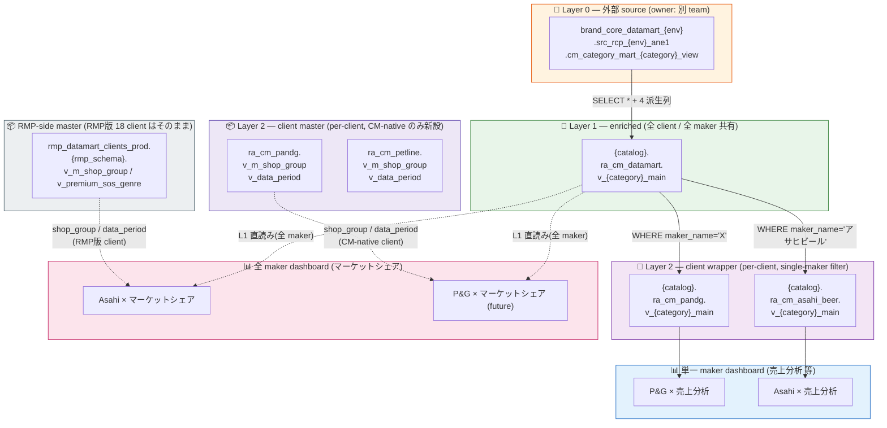

# RA_CM Design Overview — ver02 (draft)

*Last updated: 2026-08-20 18:55 JST — ver02 draft v3: Phase 1 スコープ確定 — Asahi × alcohol POC で CM-native master (`ra_cm_datamart.m_shop_group` + `ra_cm_asahi_beer.v_m_shop_group`) を dual-master 前候として構築することを反映。§7 Phase 1 詳細化 & §9 Open Question 一部確定。*

CM Dashboard の `ra_cm_` **命名 3-layer view architecture** の **ver02**。ver01 の 3-layer 骨格は維持したまま、以下 3 点を追加:

1. **Dashboard 型 (`single-maker` / `market-wide`)** の区分と、それに応じた L1/L2 read scope
2. **Client 分類 (`rmp_flavor` / `cm_native`)** と、client-side master data (shop_group / data_period) の 2-track 供給戦略
3. **CI/CD placeholder** の拡張(マーケットシェア対応)

> ver01 との後方互換: 売上分析(single-maker)は完全に ver01 と同じ挙動。ver02 で追加されるのはマーケットシェア dashboard 系のみ。

---

## 0. TL;DR

| 変更点 | ver01 | ver02 |
|--------|-------|-------|
| Dashboard 型 | `single-maker` のみ想定 | `single-maker` + `market-wide` (**マーケットシェア**) |
| L1 view の read scope | L2 (`ra_cm_{client}`) 経由でのみ read | **market-wide dashboard は L1 (`ra_cm_datamart`) を直読み** |
| Client-side master | 未定義 (dashboard SQL 内で L2 view の派生列に頼る) | `v_m_shop_group` / `v_data_period` を **RMP版 18 client** は `rmp_datamart_clients_prod` を直接使用、**CM-native client** は新設 L2 sibling view として供給 |
| CI/CD placeholder | `__CM_VIEW_FQN__` / `__CATALOG__` / `__SCHEMA__` / `__MAKER_NAME__` / `__CATEGORY_MID_EXPR__` | 上記 + `__CM_L1_VIEW_FQN__` / `__CM_SHOP_GROUP_FQN__` / `__CM_DATA_PERIOD_FQN__` / customizer 経由の competitor_makers・default_market_genre |

---

## 1. 全体像 — 3-Layer View Architecture (ver02)

**Layer 0 → Layer 1 → Layer 2 → Dashboard SQL** の 3 層は不変。追加変更は **market-wide dashboard が L1 を直読みする分岐**のみ。



### 各層の責務(ver02 追記)

| Layer | Object | Owner | 責務 | 主 consumer |
|-------|--------|-------|------|-------------|
| **Layer 0** | 外部 source view | 別 team (Datamart / ETL) | Raw data + 基本 enrichment | L1 |
| **Layer 1** | `ra_cm_datamart.v_{category}_main` | CM Dashboard team | **全 client / 全 maker 共通の enrichment 拠点**。将来 shop_group / user_info / device 実データを JOIN 予定。 | L2 + **market-wide dashboard (ver02 追加)** |
| **Layer 2 (transactions)** | `ra_cm_{client_id}.v_{category}_main` | CM Dashboard team | Client filter (`WHERE maker_name = X`) + 権限境界 | Single-maker dashboard |
| **Layer 2 (master, ver02 追加)** | `ra_cm_{client_id}.v_m_shop_group` / `v_data_period` | CM Dashboard team | Client-scoped master (shop group / data availability). **CM-native client のみ新設**。RMP版 client は使用しない。 | Market-wide dashboard (CM-native client 版) |
| **RMP master (external)** | `rmp_datamart_clients_prod.{rmp_schema}.v_m_shop_group` / `v_premium_sos_genre` | RMP team | RMP 版 client の shop_group / data period master | Market-wide dashboard (RMP版 client 版) |
| **Dashboard** | Lakeview widget dataset | Dashboard designer | UI parameter + 集計 (SUM, COUNT, GROUP BY) | End user |

---

## 2. Dashboard 型と L1/L2 read scope

Dashboard は **client の自 maker 分だけ見るタイプ (`single-maker`)** と、**同カテゴリ内の全 maker を見て市場を比較するタイプ (`market-wide`)** に分類される。両者は data 取得層が異なる。

### 2-1. `single-maker` — 売上分析 系

- **read scope**: `ra_cm_{client_id}.v_{category}_main` (L2)
- **maker**: 自 maker のみ (`WHERE maker_name = 'X'` が L2 view で適用済み)
- **GRANT**: schema 単位 (`GRANT SELECT ON SCHEMA ra_cm_{client_id}`)
- **例**: 売上分析、ブランド構成比、購買者分析(将来)

### 2-2. `market-wide` — マーケットシェア 系

- **read scope**: `ra_cm_datamart.v_{category}_main` (**L1 直読み**)
- **maker**: 同カテゴリ全 maker (自 maker + 主要競合 + その他)
- **GRANT**: L1 view に対する **per-client の SELECT GRANT** を追加
  - 具体的には `GRANT SELECT ON VIEW ra_cm_datamart.v_{category}_main TO <client_sp>`
  - schema 単位 GRANT は避ける (他 category を横断されない)
- **競合 maker リスト・自 maker 判定** は customizer が SQL を組み立てる時点で埋め込む
- **例**: マーケットシェア、シェア推移

> **なぜ L1 直読みなのか?** L2 は per-client filter が入っているため、Asahi の L2 では Sapporo / Suntory 行が見えない。かといって Asahi の L2 に競合行を混ぜると `single-maker` dashboard に悪影響。そこで **maker 全量 = L1 / maker 単独 = L2** と役割を明確に分離する。

### 2-3. Read scope マトリクス

| Dashboard | 参照 view | GRANT 単位 | データ範囲 |
|-----------|-----------|-----------|-----------|
| 売上分析 | `ra_cm_{client}.v_{category}_main` | schema | 自 maker × 全 category (client 保有分) |
| マーケットシェア | `ra_cm_datamart.v_{category}_main` | **view** (per category) | 全 maker × 対象 category のみ |

---

## 3. Client 分類 — `rmp_flavor` vs `cm_native`

Client 側 master data (shop_group / data period 等)の供給元は **client 出自** で分ける。

### 3-1. `rmp_flavor` — RMP版 18 client

RMP から移行してきた既存 client。RMP 側 datamart (`rmp_datamart_clients_prod`) に **すでに master view が存在**しており、そのまま利用する。

| RMP `report_name` | 正式クライアント名 | RMP schema |
|--------|----------|-----------|
| asahibeer | アサヒビール量販統括部 | `asahi_beer` |
| sapporobeer | サッポロビール株式会社 流通営業本部 | `sapporo_beer` (推定) |
| otsukaseiyaku | 大塚製薬株式会社 eコマース部 | `otsuka_seiyaku` (推定) |
| royalcanin | ロイヤルカナン ジャポン合同会社 | `royal_canin` (推定) |
| kao | 花王グループカスタマーマーケティング㈱ | `kao` |
| kirinbeer | キリンビール株式会社 | `kirin_beer` (推定) |
| kirinbeverage | キリンビバレッジ株式会社 | `kirin_beverage` (推定) |
| lego | レゴ | `lego` (推定) |
| loreal | ロレアル プロフェッショナル プロダクツ事業部 | `loreal` |
| panasonic | パナソニック㈱ ビューティ・パーソナルケア事業部 美容家電 | `panasonic` |
| ecovacs | エコバックス EC営業部 | `ecovacs` (推定) |
| ecoflow | エコフロー ECチーム | `ecoflow` (推定) |
| johnsonandjohnson | Johnson & Johnson Digital Strategy & Vision Experience | `johnsonandjohnson` (推定) |
| kagome | カゴメ 営業本部 健康直送事業部 | `kagome` (推定) |
| panasonic_dentalcare | パナソニック㈱ ビューティ・パーソナルケア事業部 歯ブラシ | `panasonic_dentalcare` (推定) |
| shiseido | 資生堂 | `shiseido` (推定) |
| mars | マース | `mars` (推定) |
| panasonic_shaver | パナソニック㈱ シェーバー | `panasonic_shaver` (推定) |

**master data 供給元**:
- `rmp_datamart_clients_prod.{rmp_schema}.v_m_shop_group` — 店舗グループ選択肢
- `rmp_datamart_clients_prod.{rmp_schema}.v_premium_sos_genre` — 「表示可能データ期間」用の期間 metadata

→ **CM 側で新規 view は作らない**。CI/CD 側で `__CM_SHOP_GROUP_FQN__` / `__CM_DATA_PERIOD_FQN__` placeholder を **RMP-side path** に解決すればよい。

⚠ `{rmp_schema}` の実際の名称は RMP 側 UC を要確認(上記表の "推定" 行)。設計確定時に付き合わせる必要あり。

### 3-2. `cm_native` — CM で新規オンボードした client

RMP に対応するデータ資産が存在しない、CM 発足後にオンボードした新規 client。現時点で該当:

- **`pandg` (P&G)**
- **`petline` (ペットライン)**

**master data 供給元**: CM 側 L2 に **新設** する:
- `ra_cm_{client_id}.v_m_shop_group`
- `ra_cm_{client_id}.v_data_period`

これらは同じ client の L2 schema 内に置く(schema GRANT で一括アクセス制御)。

### 3-3. Client flavor の config 表現

`clients.yml` に **`client_flavor`** と、optional な **`cm_native_master`**(dual-master flag) を追加:

```yaml
asahi_beer:
  client_flavor: rmp_flavor
  rmp_schema: asahi_beer           # rmp_datamart_clients_prod 側の schema 名
  cm_native_master: true           # RMP版だが、CM 側にも master を並行構築(将来移行の前候)
  # ...

pandg:
  client_flavor: cm_native
  # rmp_schema なし — CM 側 L2 の v_m_shop_group を必ず使う
  # ...

petline:
  client_flavor: cm_native
  # ...
```

CI/CD の `build_placeholders` で `client_flavor` + `cm_native_master` を分岐:
- **`rmp_flavor` かつ `cm_native_master=false`** (通常の RMP版 client): `__CM_SHOP_GROUP_FQN__ = rmp_datamart_clients_{env_short}.{rmp_schema}.v_m_shop_group`
- **`rmp_flavor` かつ `cm_native_master=true`** (Asahi の Phase 1 前候形態): dashboard は `__CM_SHOP_GROUP_FQN__ = {catalog}.ra_cm_{client_id}.v_m_shop_group` を優先的に指す(CM 側 master をテストしながら RMP 側も並行運用)
- **`cm_native`**: `__CM_SHOP_GROUP_FQN__ = {catalog}.ra_cm_{client_id}.v_m_shop_group`

> **Dual-master rationale (Asahi の場合)**: Phase 1 で RMP → CM 移行の pilot として Asahi のみに CM-native master を並行構築。dashboard は CM 側を参照するが、RMP 側 master も残しておくことで比較検証と rollback を可能に。CM 側の master 運用が安定した後に他 RMP版 client へ横展開する時、Asahi のノウハウをそのまま活かせる。

---

## 4. Layer 2 — client master view の設計 (CM-native 用のみ)

CM-native client(現時点 P&G / Petline)向けに Layer 2 内へ master 系 view を新設する。**RMP版と 1:1 互換の schema / 挙動** を目指し、将来の統合を容易にする。

### 4-0. RMP 側の実装(参考として先に確認)

RMP ETL リポジトリ (`rakuten-analytics/databricks-maker-sight-analytics-etl`) を調査した結果、RMP は以下の 3 段構成で shop_group を管理している。

#### RMP: 3-tier 構成

```
resources/shop_groups/{client_id}.yml     ← 1) YAML: business user が編集
       │
       ▼ load_shop_groups.py (daily job)
{catalog}._all.m_shop_group               ← 2) Delta table: shared, client_id 列で識別
       │
       ▼ CREATE VIEW WHERE client_id = X
{catalog}.{client_id}.v_m_shop_group      ← 3) Per-client view (dashboard から参照)
```

#### RMP: `m_shop_group` Delta table schema

```python
schema = StructType([
    StructField("client_id",       StringType(),  False),  # e.g., 'asahi_beer'
    StructField("shop_id",         LongType(),    True),   # NULL = fallback default
    StructField("shop_group_name", StringType(),  False),  # display label
    StructField("disp_order",      IntegerType(), False),  # dropdown 表示順
])
```

**キーポイント**:
- **`shop_id` NULLABLE** で、`shop_id IS NULL` の行は "fallback default"(どの shop にも該当しない場合の受け皿)
- **`disp_order`** は YAML 内の列挙順序(1-indexed)
- **1 client = 1 fallback 行のみ**(loader が enforcement)
- 1 shop_group_name が複数 shop に紐づく **many-to-one** 関係

#### RMP: shop_groups YAML の実データ例

`resources/shop_groups/asahi_beer.yml`:
```yaml
- label: "01.楽天24"
  shop_ids:
  - 261122

- label: "02.楽天24ドリンク館"
  shop_ids:
  - 306273

- label: "他全店舗"        # fallback (shop_ids: [] で識別)
  shop_ids: []
```

Loader (`load_shop_groups.py`) がこの YAML を読み、`client_id='asahi_beer'` として `m_shop_group` に (label, shop_id) を expand した行を書き込む。

#### RMP: `v_m_shop_group` DDL (per-client)

```sql
CREATE OR REPLACE VIEW rmp_datamart_clients_{env}.asahi_beer.v_m_shop_group AS
SELECT shop_id, shop_group_name, disp_order
FROM   rmp_datamart_clients_{env}._all.m_shop_group
WHERE  client_id = 'asahi_beer';
```

#### RMP: `v_premium_sos_genre` の実態は "fact + shop_group enrichment"

```sql
CREATE OR REPLACE VIEW rmp_datamart_clients_{env}.asahi_beer.v_premium_sos_genre AS
SELECT
  f.* EXCEPT (shop_name),
  COALESCE(sg.shop_group_name, fb.shop_group_name) AS shop_group_name
FROM   rmp_datamart_clients_{env}._all.premium_sos_genre f
LEFT JOIN rmp_datamart_clients_{env}.asahi_beer.v_m_shop_group sg
  ON  f.shop_id = sg.shop_id
LEFT JOIN rmp_datamart_clients_{env}.asahi_beer.v_m_shop_group fb
  ON  fb.shop_id IS NULL     -- fallback row
WHERE  f.contract_business_unit_id = 2;
```

これは **単なる「期間 metadata view」ではなく、市場シェア分析用の fact view** である。`v_m_shop_group` を 2 回 LEFT JOIN (match & fallback) することで `shop_name` を `shop_group_name` に置換し、下位 dashboard がそのままシェア分析に使えるように整形している。

> **重要な理解**: RMP の `v_premium_sos_genre` = CM の `v_{category}_main` に相当する fact view。ただし RMP は 1 view で全 category を持ち、CM は category 別に view を分けている。**セマンティクス的には両者は「全 maker × 市場ジャンル × 時系列 fact」で等価**。

---

### 4-1. `v_m_shop_group` — CM-native 版設計

**RMP と完全に同じ 3-tier 構成をコピー**する。この設計により、将来 RMP 側から CM 側へ shop_group 管理を移管する場合も、YAML と loader が同じままで済む。

#### 4-1-1. YAML 定義 (business-user editable)

Location: `cm_dashboard_cicd_poc/src/infrastructure/shop_groups/{client_id}.yml`

Format (RMP 完全互換):
```yaml
# cm_dashboard_cicd_poc/src/infrastructure/shop_groups/pandg.yml
- label: "01.楽天ビック"
  shop_ids:
  - 12345
- label: "02.ケンコーコム"
  shop_ids:
  - 67890
- label: "他全店舗"
  shop_ids: []
```

#### 4-1-2. Delta table: `ra_cm_datamart.m_shop_group`

Schema (RMP 完全互換):
```python
StructType([
    StructField("client_id",       StringType(),  False),
    StructField("shop_id",         LongType(),    True),
    StructField("shop_group_name", StringType(),  False),
    StructField("disp_order",      IntegerType(), False),
])
```

配置: **`ra_cm_datamart` schema 内** (L1 と同じ schema)。理由:
- CM-native master は全 CM-native client 共有 → L1 と同居が自然
- Per-client access 制御は下段の view で行う
- `_all` のような別 schema を新設せずに済む(命名複雑化を回避)

#### 4-1-3. Loader script

Option A (推奨): **RMP `load_shop_groups.py` を fork して CM 用に転用**
- CM CI/CD リポジトリ (`cm_dashboard_cicd_poc/src/infrastructure/scripts/load_cm_shop_groups.py`) に配置
- target を `{catalog}.ra_cm_datamart.m_shop_group` に変更
- source dir を `cm_dashboard_cicd_poc/src/infrastructure/shop_groups/` に変更
- 実行タイミング: Databricks job (daily) or 手動 (PoC 段階は手動でも可)

Option B: **PoC 段階は SQL infrastructure file で手書き INSERT**
- 実装は最小
- YAML 編集ワークフローを持たない
- 動作確認用としては可

#### 4-1-4. Per-client view: `ra_cm_{client_id}.v_m_shop_group`

```sql
CREATE OR REPLACE VIEW {catalog}.ra_cm_pandg.v_m_shop_group AS
SELECT shop_id, shop_group_name, disp_order
FROM   {catalog}.ra_cm_datamart.m_shop_group
WHERE  client_id = 'pandg';
```

Dashboard SQL からは `` `{catalog}`.`ra_cm_pandg`.`v_m_shop_group` `` として参照。RMP 版と DDL / column が 1:1 一致するため、dashboard 側 SQL は client_flavor によって FQN placeholder が切り替わるだけで済む。

---

### 4-2. `v_premium_sos_genre` 相当 — CM 側の "market_share fact view" 設計

RMP の `v_premium_sos_genre` は前述の通り **fact + shop_group enrichment** の 2 責務を持つ。CM 側でこれと等価なものを作るなら以下:

#### 4-2-1. 責務分解

CM 側ではすでに以下がある:
- **Fact**: `{catalog}.ra_cm_datamart.v_{category}_main` (L1、全 maker) ← RMP `_all.premium_sos_genre` に相当
- **Master**: `{catalog}.ra_cm_{client}.v_m_shop_group` (§4-1)

これらを JOIN する **client-scoped enriched fact view** を新設:
```sql
CREATE OR REPLACE VIEW {catalog}.ra_cm_pandg.v_{category}_market_main AS
SELECT
  f.*,
  COALESCE(sg.shop_group_name, fb.shop_group_name) AS shop_group_name_client
FROM   {catalog}.ra_cm_datamart.v_{category}_main f
LEFT JOIN {catalog}.ra_cm_pandg.v_m_shop_group sg
  ON  f.shop_id = sg.shop_id
LEFT JOIN {catalog}.ra_cm_pandg.v_m_shop_group fb
  ON  fb.shop_id IS NULL;
```

命名: `v_{category}_market_main` — 「market-wide (全 maker) × client 拡張列」を明示。既存 `v_{category}_main`(single-maker) と併存。

⚠ Column name は既存 L1 に `shop_group_name`(NULL placeholder)が存在するため、CM-native client-scoped 拡張列は `shop_group_name_client` として区別することを推奨。ただし将来的に L1 の `shop_group_name` が populated されたら再検討。

#### 4-2-2. **本 POC では作らない**(重要)

参考ファイル(`[CM Alpha_v01][Asahi Beer] マーケットシェア.lvdash.json`)を精読した結果、**`shop_group_filter` は widget として存在するが main SQL には接続されておらず、dead widget 状態**(参考ファイル内コメント "shop_group_filter / is_used は CM に存在しないため削除")。

そのため:
- **Phase 1 (Asahi × alcohol POC)**: `v_{category}_market_main` は不要。**dashboard は L1 (`ra_cm_datamart.v_alcohol_main`) を直読み** し、shop_group 関連 widget は非表示 or 空選択肢のまま。
- **Phase 2 以降** (CM-native client に shop_group filter を wire する時): §4-2-1 の enriched view を追加。

---

### 4-3. `v_data_period` — 期間 metadata の扱い

RMP: `v_premium_sos_genre` に `date_type='MONTHLY'/'DAILY'` の行があり、`SELECT MIN(dt), MAX(dt) WHERE date_type='MONTHLY'` で表示期間を取得。

CM: 同等の集約が必要だが、L1 view (`v_{category}_main`) から直接 `MIN(reg_date) / MAX(reg_date)` を取れる。

**Phase 1 案 (推奨)**: 別 view を作らず、dashboard SQL に inline で:
```sql
-- ds_data_period_range (dashboard SQL 内)
SELECT
  DATE_FORMAT(MIN(CAST(reg_date AS DATE)), 'yyyy年M月')
  || ' 〜 ' ||
  DATE_FORMAT(MAX(CAST(reg_date AS DATE)), 'yyyy年M月')
  AS data_period_range
FROM `{catalog}`.`ra_cm_datamart`.`v_alcohol_main`
```

⚠ **考慮点**: L1 は全 maker 分の期間を返すため、client の「保有データ」概念と厳密には一致しない場合がある。ただし market_share は全 maker を見るのが目的なので、この semantic はむしろ正しい。

**Phase 2 案** (client-scoped 期間が必要になった時): `ra_cm_{client}.v_data_period` を新設:
```sql
CREATE OR REPLACE VIEW {catalog}.ra_cm_pandg.v_data_period AS
SELECT 'MONTHLY' AS date_type,
       DATE_TRUNC('MONTH', reg_date) AS dt
FROM   {catalog}.ra_cm_pandg.v_daily_necessities_main   -- L2 (自 maker のみ)
GROUP BY DATE_TRUNC('MONTH', reg_date);
```

---

### 4-4. Schema 分離するか?

Master 系 view (`v_m_*`) と transaction 系 view (`v_{category}_main`) を **同じ `ra_cm_{client_id}` schema** に置くか、`ra_cm_{client_id}_master` に分けるか。

| 案 | Pros | Cons |
|----|------|------|
| **同一 schema** | GRANT を 1 回で済ませられる。RMP の `rmp_datamart_clients_prod.{client}` も同じ流儀。 | Schema 内が混在。命名 prefix (`v_m_` / `v_`) で識別する必要あり。 |
| 別 schema (`ra_cm_{client_id}_master`) | 責務が schema level で分離。 | GRANT が 2 回。新 client 追加時の DDL 数が増える。 |

**推奨**: **同一 schema + naming prefix (`v_m_*`)**。RMP conventions とも一致。

### 4-5. CM-native master view 作成の判断フロー

```
┌────────────────────────────────────────────────────────┐
│ 新規 client × カテゴリで market_share を追加したい      │
└──────────────────────┬─────────────────────────────────┘
                       │
                       ▼
        client_flavor = ?
              │
      ┌───────┴──────────┐
      ▼                  ▼
   rmp_flavor        cm_native
      │                  │
      │                  ▼
      │        shop_group filter を使う?
      │              │
      │      ┌───────┴──────┐
      │      ▼              ▼
      │    Yes             No
      │      │              │
      │      ▼              ▼
      │  §4-1 で       §4 の master view
      │  v_m_shop_group    は作らない
      │  作成            (L1 直読みのみ)
      │      │              │
      ▼      ▼              ▼
   RMP 側        Phase 2 で         Phase 1 完了
   既存 view      新設              可能な最小構成
   をそのまま
   使う
```

---

## 5. Market Share dashboard の SQL データ取得パターン

### 5-1. FROM 節

- **Transaction data**: `` `{catalog}`.`ra_cm_datamart`.`v_{category}_main` `` (L1 直読み)
- **Shop group**: `client_flavor` で分岐 (§3-3)
- **Data period**: `client_flavor` で分岐 (§3-3)

### 5-2. Maker 判定 SQL (customizer が生成)

Config:
```yaml
# clients.yml (asahi_beer)
dashboard_overrides:
  market_share:
    customizer:
      competitor_makers: ["サッポロビール", "サントリー", "キリンビール"]
```
```yaml
# categories.yml (alcohol)
market_share:
  default_market_genre: "ビール・洋酒"
  other_bucket_label: "その他"
  own_bucket_label: "自社"
  competitor_bucket_label: "競合"
```

Customizer 出力(例):
```sql
-- __$_MAKER_BRAND_DISPLAY_CASE__
CASE
  WHEN maker_name = 'MakerAssorted' THEN 'その他'
  WHEN maker_name = 'アサヒビール'  THEN maker_name
  WHEN maker_name IN ('サッポロビール','サントリー','キリンビール') THEN maker_name
  ELSE 'その他'
END

-- __$_IS_OWN_MAKER__
CASE WHEN maker_name = 'アサヒビール' THEN 1 ELSE 0 END

-- __$_DEFAULT_MARKET_GENRE_LIST__
'ビール・洋酒'
```

### 5-3. GRANT 追加要件

Market Share 対応 client の SP に L1 view の SELECT GRANT を追加:

```sql
GRANT SELECT ON VIEW {catalog}.ra_cm_datamart.v_alcohol_main TO `<asahi_beer_sp>`;
```

**注意**: schema GRANT (`GRANT SELECT ON SCHEMA ra_cm_datamart`) は避ける。他 client が保有していない category (Asahi なら日用品等)へのアクセスまで許してしまう。

---

## 6. CI/CD placeholder 拡張 (ver02)

### 6-1. `generate_sql.py` RESERVED 追加

| Placeholder | 解決値の例 (STG / Asahi × alcohol) |
|-------------|--------------------------------------|
| `__CM_L1_VIEW_FQN__` | `` `maker_sight_analytics_stg_...`.`ra_cm_datamart`.`v_alcohol_main` `` |
| `__CM_SHOP_GROUP_FQN__` | `` `rmp_datamart_clients_stg`.`asahi_beer`.`v_m_shop_group` `` (RMP版) or `` `{catalog}`.`ra_cm_pandg`.`v_m_shop_group` `` (CM-native) |
| `__CM_DATA_PERIOD_FQN__` | `` `rmp_datamart_clients_stg`.`asahi_beer`.`v_premium_sos_genre` `` (RMP版) or `` `{catalog}`.`ra_cm_pandg`.`v_data_period` `` (CM-native) |

### 6-2. Customizer 出力(`__$_` prefix)

| Key | 内容 |
|-----|------|
| `__$_COMPETITOR_MAKERS_LIST__` | SQL 用文字列 (`'サッポロビール','サントリー','キリンビール'`) |
| `__$_MAKER_BRAND_DISPLAY_CASE__` | 表示名 CASE ブロック(§5-2) |
| `__$_MAKER_BRAND_SORT_CASE__` | ソートキー CASE ブロック |
| `__$_IS_OWN_MAKER_CASE__` | `CASE WHEN maker_name = 'X' THEN 1 ELSE 0 END` |
| `__$_OWN_MAKER_LABEL_CASE__` | `CASE WHEN maker_name = 'X' THEN '自社' ELSE '競合' END` |
| `__$_DEFAULT_MARKET_GENRE_LIST__` | `'ビール・洋酒'` (SQL リテラル文字列) |

### 6-3. `dashboards.yml` エントリ

```yaml
market_share:
  display_name: "マーケットシェア"
  template_dir: market_share
  customizer: market_share
  output_stem: market_share
  default_customizer:
    other_bucket_label: "その他"
    own_bucket_label: "自社"
    competitor_bucket_label: "競合"
```

### 6-4. `categories.yml` 追加(alcohol のみ、当面)

```yaml
alcohol:
  # ...既存...
  market_share:
    default_market_genre: "ビール・洋酒"
```

### 6-5. `clients.yml` 追加(asahi_beer のみ、当面)

```yaml
asahi_beer:
  client_flavor: rmp_flavor
  rmp_schema: asahi_beer
  categories:
    alcohol:
      dashboards:
        - sales_analysis
        - market_share
      dashboard_overrides:
        market_share:
          customizer:
            competitor_makers: ["サッポロビール", "サントリー", "キリンビール"]
```

---

## 7. 実装ロードマップ

### Phase 1 — Asahi Beer × 酒類 × マーケットシェア (STG)

**確定スコープ**: RMP 版 client である Asahi にも **CM-native master を並行構築**(dual-master 前候)。将来 RMP → CM 移行 pilot として活用。

#### 7-1-1. Datamart 側 (infrastructure)
1. **L1 GRANT 追加**: `GRANT SELECT ON VIEW {stg_catalog}.ra_cm_datamart.v_alcohol_main TO <asahi_sp>` (現時点は PAT owner)
2. **`m_shop_group` Delta table 新設**: `{stg_catalog}.ra_cm_datamart.m_shop_group` (schema = §4-1-2 と同じ)
3. **Shop group YAML 新設**: `cm_dashboard_cicd_poc/src/infrastructure/shop_groups/asahi_beer.yml`(RMP 側 `resources/shop_groups/asahi_beer.yml` を初期値としてコピー)
4. **Loader**: Phase 1 は SQL INSERT で bootstrap(§4-1-3 Option B)。実行は infrastructure SQL editor で手動。将来 Phase 2 で Python loader に移行(Option A)。
5. **Per-client view**: `CREATE OR REPLACE VIEW {stg_catalog}.ra_cm_asahi_beer.v_m_shop_group AS SELECT shop_id, shop_group_name, disp_order FROM {stg_catalog}.ra_cm_datamart.m_shop_group WHERE client_id = 'asahi_beer';`

#### 7-1-2. Dashboard CI/CD 側
6. `dashboards.yml` に `market_share:` block を有効化
7. `categories.yml` の alcohol に `market_share:` block (default_market_genre 等)
8. `clients.yml` の asahi_beer に `client_flavor: rmp_flavor` + `cm_native_master: true` + market_share dashboard 追加
9. `scripts/customizers/market_share.py` 新設(competitor_makers / market_genre から CASE 文を組み立て)
10. `templates/market_share/*.sql.tpl` 新設 (推定 13 files)
11. `.lvdash.json` を placeholder 化(参考ファイル `/Users/.../Downloads/[CM Alpha_v01][Asahi Beer] マーケットシェア.lvdash.json` をベース)
    - Main data source → `__CM_L1_VIEW_FQN__`
    - Shop group filter → `__CM_SHOP_GROUP_FQN__` (Asahi は CM 側 = `{catalog}.ra_cm_asahi_beer.v_m_shop_group` を指す)
    - Data period range → **L1 の `MIN/MAX(reg_date)` を inline で計算**(v_data_period view は作らない)

#### 7-1-3. Deploy & 検証
12. `generate_sql` → `prepare_deploy -t stg` → `databricks bundle deploy -t staging`
13. STG data 実態を認識した上で構造検証:
    - `ra_cm_datamart.v_alcohol_main` on STG: 41K rows, `サントリービール` のみ
    - `アサヒビール` 実データ 0 rows のため、Asahi 自社シェアは常に 0% になる
    - shop_group dropdown は Asahi YAML に基づき ("01.楽天24" / "02.楽天24ドリンク館" / "他全店舗") の 3 選択肢が出る
    - **SQL 構造 / dashboard 表示ロジック / filter 相互作用**の検証が Phase 1 のゴール

### Phase 2 — P&G / Petline / 他 CM-native client に横展開する時 (別 issue)
1. `resources/shop_groups/{pandg,petline,...}.yml` を追加
2. Python loader (§4-1-3 Option A) を fork して daily job 化
3. `clients.yml` に `client_flavor: cm_native` 設定
4. Per-client `competitor_makers` / per-category `default_market_genre` 定義
5. 同じ template で generate → deploy
6. 必要に応じて §4-2 の `v_{category}_market_main` を実装(shop_group_name の inline join を hide したい場合)

### Phase 3 — PROD 反映 (Phase 1 完了後)
- L1 GRANT を PROD に反映
- `ra_cm_datamart.m_shop_group` PROD 版を bootstrap(同じ YAML から)
- `ra_cm_asahi_beer.v_m_shop_group` PROD 版を DDL
- STG で構造検証済みなら CI/CD 側 deploy はほぼ template 置換のみ

---

## 8. 命名規則(既存 + ver02 追記)

### 8-1. Schema (既存 = ver01 と同じ)

| Schema | Scope |
|--------|-------|
| `ra_cm_datamart` | Layer 1, 全 client 共通 |
| `ra_cm_{client_id}` | Layer 2, per-client (transaction + **master, ver02 追加**) |

### 8-2. View 命名 (ver02)

| Prefix | 意味 | 例 |
|--------|------|-----|
| `v_{category}_main` | Transaction (既存) | `v_alcohol_main` |
| `v_m_*` (**ver02 追加**) | Master (client-scoped) | `v_m_shop_group` |
| `v_data_period` (**ver02 追加**) | Data availability metadata | `v_data_period` |

RMP 側 (`rmp_datamart_clients_prod.{client}`) との命名整合:
- `v_m_shop_group` — 完全一致
- `v_data_period` — RMP 側は `v_premium_sos_genre` だが、CM 側は semantic を優先し新命名を採用

---

## 9. Open Questions (要判断)

### Q1. L1 GRANT の単位
view 単位 (`v_alcohol_main` のみ) vs schema 単位 (`ra_cm_datamart` 全体)。§5-3 で "view 単位" を推奨したが、client が複数 category にまたがる場合 GRANT 数が増える。運用コスト vs isolation のトレードオフ確認。

**候補案**:
- **A (推奨)**: view 単位。Asahi × alcohol なら `GRANT SELECT ON VIEW ra_cm_datamart.v_alcohol_main TO <sp>` の 1 行のみ。追加 category が来たら都度 GRANT を追加。
- **B**: schema 単位で "market_share 対応 client 全員" 用の別 sub-schema (`ra_cm_datamart_public`?)。Over-engineering ぎみ。

### Q2. Phase 1 で `v_m_shop_group` を作るか — **CONFIRMED: 作る**
2026-08-20 判断: **Asahi × alcohol Phase 1 でも CM-native master を並行構築**(dual-master 前候として)。理由:
- 将来 RMP → CM 移行の pilot として Asahi を使う
- CM 側 loader / DDL / YAML ワークフローを Phase 1 で立ち上げておくことで、Phase 2 (P&G, Petline) の展開コストを削減
- RMP 側 master を残したままなので rollback リスクなし

具体タスクは §7-1-1 参照。

### Q3. RMP 側 18 client の実 schema 名確認
§3-1 の "推定" 行を RMP 側 UC で実際に確認する必要あり。全 18 client 分の実 schema 名を確定させたい(現時点 Asahi/Kao/Loreal/Panasonic の 4 client のみ既知)。

**確認方法**: `SHOW SCHEMAS IN rmp_datamart_clients_prod` を SQL editor で実行。または `RMP/databricks-maker-sight-analytics-etl/src/pipelines/rmp_views/sql/clients/*.sql` のファイル名を確認(19 file 分). 実際にファイル名を確認すると:

- `asahi_beer`, `kao`, `loreal`, `panasonic_beauty_appliances`, `panasonic_dental`, `panasonic_mens_shaver`, `sapporo`, `sapporobeer`, `royal_canin`, `otsuka_pharmaceutical`, `mars`, `lego`, `kirin_beverage`, `kirin_beer`, `kagome`, `johnson_and_johnson`, `ecovacs`, `ecoflow`, `shiseido`(19)

⚠ `sapporo` と `sapporobeer` が両方存在するのは複数 BU の可能性。実データ確認が必要。

### Q4. `ra_cm_asahi_beer` の "sibling" master view を作らないか? — **CONFIRMED: 作る**
2026-08-20 判断: Phase 1 で作る(Q2 と同一背景)。§3-3 の dual-master flag (`cm_native_master: true`) で表現。

### Q5. Shop group master の実データがない期間の UX
Phase 1 は空 view で始める案(§4-1)だが、shop_group_name filter が空 dropdown だと dashboard 上で "選択肢が無い" 状態になる。widget を最初から hide しておくか、"すべて" だけ表示する fallback を入れるか。

**推奨**: Phase 1 では **widget を JSON から削除** (dead widget として持たない)。Phase 2 で filter を wire する時に widget を追加。

### Q6. RMP `load_shop_groups.py` を fork するか、独自実装するか — **CONFIRMED: Phase 1 は SQL INSERT / Phase 2 で fork**
Phase 1 (Asahi のみ) は Option B (SQL INSERT bootstrap) で最速立ち上げ。Phase 2 (CM-native client 展開) 時に Option A (Python loader fork + daily job 化) に移行。

### Q0 (新規). Dual-master 中の dashboard 参照戦略
Asahi は Phase 1 で **CM 側 master (`ra_cm_asahi_beer.v_m_shop_group`) と RMP 側 master (`rmp_datamart_clients_prod.asahi_beer.v_m_shop_group`) の 2 経路**が並行して存在する。dashboard SQL はどちらを見に行くか?

**推奨案**: **CM 側を優先参照**。理由:
- 移行が完了した将来像に近い運用を Phase 1 から始められる
- CM 側 loader / DDL のバグを早期発見できる
- RMP 側は「rollback 用の safety net」として残す(dashboard は触れない)

具体的には CI/CD の `client_flavor + cm_native_master` 分岐で:
- `rmp_flavor` + `cm_native_master=true` → **CM 側 FQN を採用** (§3-3 で示した通り)

もし将来「Asahi は RMP 側だけを見続ける」ことにするなら、`cm_native_master: false` に切り替えれば dashboard SQL 側は自動で切り替わる。

---

*Historical: ver01 は [ra_cm_design_overview.md](./ra_cm_design_overview.md) 参照。*
